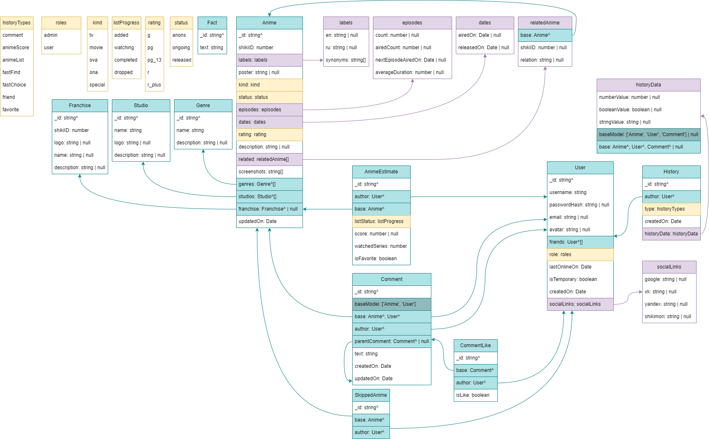

# **Скрипт-парсер Bisky**

# Init

Перед вызовом скриптов нужно

- прописать в консоль
  ```
  pnpm i
  ```
- после вызвать скрипт build
  ```
  pnpm run build
  ```

# Вызов скриптов для парсинга

> Вызов скриптов происходит через команду

```
node ./build/main/название_скрипта.js
```

## ParseGenres

Спарсить данные о жанрах

## ParseUpdateAnimes

Спарсить данные о аниме по их обновлению **(ongoing/anons)**

> к примеру, переход из анонса в онгоинг или выход новой серии

## ParseAnimesByYear

Спарсить данные о аниме по годам _(Принимает два параметра)_

> Изменять параметры нужно в файле **package.json**

- from - с какого года
- to - по какой год (если не писать второе число, то спарсится только from-год)

  > **ParseAnimesByYear 2010 2012** - спарисить все аниме в период 2010-2012

  > **ParseAnimesByYear 2010** - спарисить все аниме за 2010 год

# Схема базы данных


